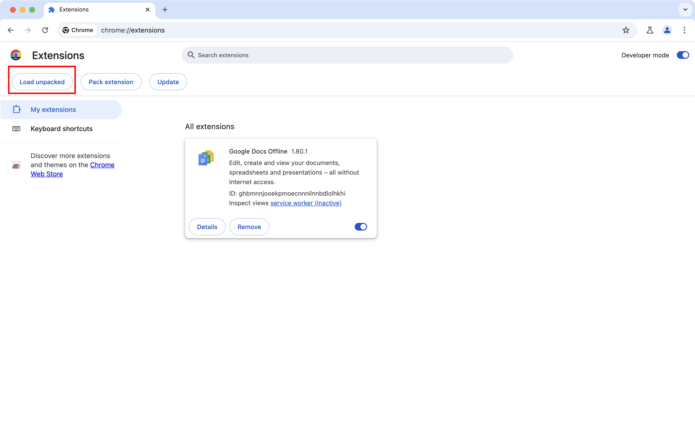
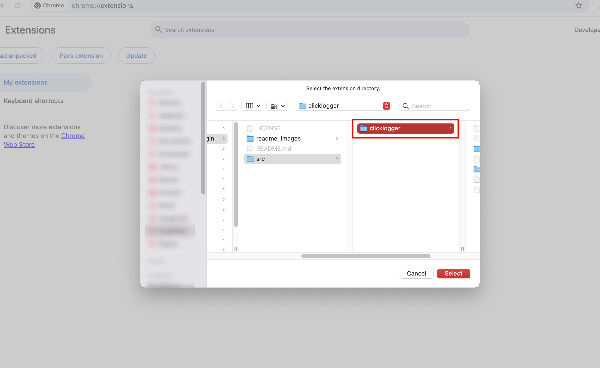

# AgentNet-Chrome-Plugin

Add Chrome Support for AgentNet

### Setup Instruction:

Please use **Goole Chrome Dev** to load the unpacked extension and complete your workflow.

You should download the unpacked extension first:

```bash
$ git clone https://github.com/fyq5166/AgentNet-Chrome-Plugin.git
```




